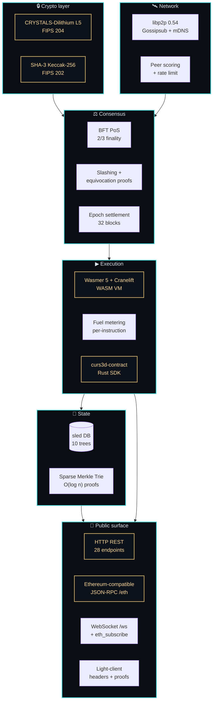

<!--
   ════════════════════════════════════════════════════════════════════
     Pazent's GitHub profile README
     Repo: github.com/Pazificateur69/Pazificateur69
     Files needed at the repo root:
       - README.md         (this file)
       - assets/hero.svg   (the animated banner)
   ════════════════════════════════════════════════════════════════════
-->

<a id="top"></a>
<p align="center">
  
</p>

<p align="center">
  <a href="https://api.curs3d.fr/api/healthz">
    
  </a>
  <a href="https://api.curs3d.fr/api/status">
    
  </a>
  <a href="https://api.curs3d.fr/api/status">
    
  </a>
  <a href="https://api.curs3d.fr/api/status">
    
  </a>
  <a href="https://github.com/Pazificateur69/curs3d">
    
  </a>
</p>

<p align="center">
  <em>The four badges above are live — they fetch the actual testnet right now, every time someone views this page.</em>
</p>

<br/>

<table align="center" border="0">
<tr><td align="center">

> *"Every signature on every chain since 2009 will be retroactively breakable*<br/>
> *the day a useful quantum computer ships. The fix isn't another L1.*<br/>
> *The fix is post-quantum primitives at layer 1 — done right, done now."*

</td></tr>
</table>

<br/>

---

## ⌬ &nbsp;Featured project — **CURS3D**

A Layer 1 blockchain written from the ground up in Rust, using NIST-standardized post-quantum cryptography from genesis. No fork, no copy of any existing chain — every component (consensus, crypto, networking, storage, VM, API) implemented from zero.

<table>
  <tr>
    <td valign="top" width="40%">

### Why post-quantum, why now

NIST published **FIPS 204** (CRYSTALS-Dilithium) in **August 2024**. The US **CNSA 2.0** mandate requires post-quantum migration of all federal systems by **2030**. The EU's **eIDAS 2.0** digital wallet will require it as well.

**Bitcoin, Ethereum, Solana, every other chain** is built on ECDSA — broken in polynomial time by Shor's algorithm. The migration is a research-grade problem nobody has solved at L1 yet.

CURS3D is a working reference implementation of what that migration looks like, end-to-end.

  </td>
    <td valign="top" width="60%">

### Quantum-readiness, side by side

| Chain | Signature scheme | Quantum-resistant | NIST-approved |
|---|:---:|:---:|:---:|
| Bitcoin | secp256k1 / ECDSA | ❌ | ❌ |
| Ethereum | secp256k1 / ECDSA | ❌ | ❌ |
| Solana | Ed25519 | ❌ | ❌ |
| Cosmos / Cardano | Ed25519 / EdDSA | ❌ | ❌ |
| QRL (only legacy) | XMSS (stateful) | ✅ partial | ⚠ (FIPS 205 yes, but stateful issues) |
| **CURS3D** | **CRYSTALS-Dilithium L5** | ✅ | ✅ **FIPS 204** |

The "harvest now, decrypt later" attack means *every transaction signed today* is a future liability.

  </td>
  </tr>
</table>

<br/>

<p align="center">
  <a href="https://curs3d.fr"><b>📄 &nbsp;Whitepaper</b></a>&nbsp; · &nbsp;
  <a href="https://explorer.curs3d.fr"><b>🌐 &nbsp;Live explorer</b></a>&nbsp; · &nbsp;
  <a href="https://curs3d.fr/run-validator.html"><b>⚙ &nbsp;Run a validator</b></a>&nbsp; · &nbsp;
  <a href="https://github.com/Pazificateur69/curs3d"><b>⌹ &nbsp;Source</b></a>
</p>

<br/>

<details>
<summary><b>⌬ &nbsp;Architecture · click to expand</b></summary>



</details>

<details>
<summary><b>🜲 &nbsp;Try it in 30 seconds — copy-paste this terminal session</b></summary>

```bash
# Status — proves the chain is alive
curl -s https://api.curs3d.fr/api/status | jq

# Ethereum-compatible JSON-RPC — works with Metamask, ethers.js, wagmi
curl -s -X POST https://api.curs3d.fr/eth \
  -H 'content-type: application/json' \
  -d '{"jsonrpc":"2.0","id":1,"method":"eth_chainId"}'

# Get a free 100-CUR faucet drop
curl -s -X POST https://api.curs3d.fr/api/faucet/request \
  -H 'content-type: application/json' \
  -d '{"address":"YOUR_CUR_ADDRESS"}'

# Stream live blocks over WebSocket
websocat wss://api.curs3d.fr/ws
```

</details>

<details>
<summary><b>📐 &nbsp;Stats at a glance</b></summary>

| | |
|---|---|
| Lines of Rust | ~31,400 |
| Tests passing | **145 / 145** |
| Clippy warnings | **0** |
| Modules | 17 |
| Transaction types | 12 |
| API endpoints | 28 |
| BFT validators live | 4 (Marseille, EU) |
| Block time | 10 s |
| Epoch length | 32 blocks |
| Block reward | 50 CUR |
| Smart-contract VM | Wasmer 5 + Cranelift |
| SDK example contracts | 5 (counter, ERC-20, multisig, NFT, vesting) |

</details>

<br/>

---

## 🜨 &nbsp;Stack — picked for one reason: it's what serious systems need

```text
┌─ Languages ─────────────────────────────────────────────────────────
│   Rust (edition 2024) for everything that must not fail silently
│   TypeScript / React / Tailwind for things humans will look at
│   Bash / Python for ops, glue, throwaway tools
│
┌─ Crypto ────────────────────────────────────────────────────────────
│   pqcrypto-dilithium  (Dilithium L5, FIPS 204)
│   sha3                (Keccak-256, double-hash for blocks)
│   aes-gcm + argon2id  (encrypted wallets, hardened params)
│
┌─ Async runtime + networking ────────────────────────────────────────
│   tokio 1.x            • runtime
│   libp2p 0.54          • Gossipsub + mDNS + noise + yamux
│   hyper 1.x            • HTTP + WebSocket
│
┌─ Execution + state ─────────────────────────────────────────────────
│   wasmer 5 + cranelift • deterministic WASM VM with fuel metering
│   sled                 • embedded transactional KV store
│   sparse merkle trie   • O(log n) inclusion proofs (custom)
│
┌─ Infra & observability ─────────────────────────────────────────────
│   docker + docker-compose · systemd + WatchdogSec
│   nginx + certbot (auto-renew)
│   prometheus + grafana (status.curs3d.fr, public)
│   github actions CI · clippy/fmt/test gates
```

<br/>

---

## ✦ &nbsp;On GitHub

<p align="center">
  <a href="https://github.com/Pazificateur69">
    
    
  </a>
</p>

<p align="center">
  <a href="https://git.io/streak-stats">
    
  </a>
</p>

<p align="center">
  
</p>

<br/>

---

## 𓅪 &nbsp;The snake — eats my contribution graph every 6h

<p align="center">
  <picture>
    <source media="(prefers-color-scheme: dark)" srcset="https://raw.githubusercontent.com/Pazificateur69/Pazificateur69/output/github-snake-dark.svg" />
    <source media="(prefers-color-scheme: light)" srcset="https://raw.githubusercontent.com/Pazificateur69/Pazificateur69/output/github-snake.svg" />
    
  </picture>
</p>

<br/>

---

## ☎ &nbsp;If you're funding, hiring, or building something hard

<table>
  <tr>
    <td valign="top" width="33%">
      <h3>🎓 Grants & funders</h3>
      Looking for grant collaborations on post-quantum infrastructure, formal verification, and BFT research. NLnet / EU NGI, Ethereum Foundation ESP, Web3 Foundation — let's talk.
      <br/><br/>
      <a href="mailto:agencenetstrategy@gmail.com"><b>agencenetstrategy@gmail.com</b></a>
    </td>
    <td valign="top" width="33%">
      <h3>🛠 Hiring or freelance</h3>
      Open to senior Rust / blockchain / cryptographic-systems work. Comfortable with: BFT consensus, WASM VMs, libp2p stacks, post-quantum primitives, op-level systems engineering, on-call.
      <br/><br/>
      <a href="https://www.linkedin.com/in/agencenetstrategy/"><b>LinkedIn</b></a>
    </td>
    <td valign="top" width="33%">
      <h3>🤝 Collaborate on CURS3D</h3>
      Issues, PRs, audit feedback, bug reports — all welcome on the public repo. Interested in writing a contract, running a validator, or porting an existing protocol to PQ? Open an issue.
      <br/><br/>
      <a href="https://github.com/Pazificateur69/curs3d/issues"><b>Open an issue</b></a>
    </td>
  </tr>
</table>

<br/>

---

<p align="center">
  <sub>
    <em>
      Building things meant to last is unfashionable. So is building from zero.<br/>
      So is doing it solo. So is doing it open. I built this anyway because the alternative<br/>
      is waiting for someone else to do it, and the math says we don't have that long.
    </em>
  </sub>
</p>

<p align="center">
  <a href="#top">↑ &nbsp;back to top</a>
</p>

<p align="center">
  
  <a href="https://github.com/Pazificateur69?tab=followers">
    
  </a>
  <a href="https://github.com/Pazificateur69/curs3d">
    
  </a>
</p>

<sub><sup><i>Last refresh of dynamic widgets depends on third-party services (shields.io, demolab, vercel). Static SVG hero is local — never goes down.</i></sup></sub>
